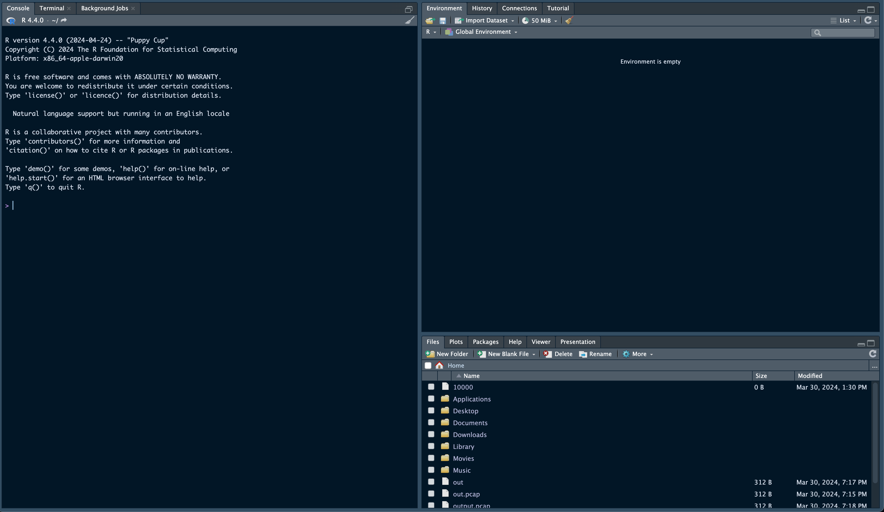

# Week 1

## RStudio Layout/Menu
New R-Script:

Window Layout:

Package Manager (For add-ons and such):

Help Tab (Documentation)

More Options for File Types:

Mini Menu Bar for More Functionality

## Writing Scripts

### Objects
To declare a variable (object in this R), You must follow this syntax:
[Object Name] <- [Object Value]

When you create a new object, it will show up in the "Environment" Tab in the Top-Right Pane (default layout.)
It will appear as a table
Ex: x <- 5
	  y <- 6

#### Note:
If you want to clear the "Environment" tab, you can start your R Script file with "rm()." This function will clear the "Environment" tab every time the code starts, as long you have that function there. You could also use "rm()" in the "Console" for a quick "Environment" clean.

## Visualization

### Pie Chart Basics
To generate a Pie Chart, you can use the "pie()" function.
By default, the Pie starts at the positive x-axis and moves counterclockwise as it plots the other pies.
Ex: 
x <- c(10, 20, 30, 40)
pie(x)

We first declare an object, x in this case, containing the values of the pie in a vector [Denoted by "c()"] and plug it in to the "pie()" function by calling the object x in the "pie()" function.

The Value divided by the sum of all values: x/sum(x)

#### Note:
It is best to comment as you code, so you can go back into your code another day and remember and understand your code, and it also helps other people understand your code.

### Detailing Pie Charts
When you want to make your Pie Chart more detailed, you can use the parameters for the "pie()" function.
Ex: 
x <- c(10, 20, 30, 40)

mylabel <- c("Apples", "Bananas", "Cherries", "Dates")

pie(X, label=mylabel, main="Fruits")

In this example, we have declared 2 objects; One for the pie values and one for the pie labels. We can now plug these in into the parameters we want them to represent. Of course, the order of each object correspondingly matches to each other. For example, "Apples" would correspond to 10. The "main" parameter is for the header/title of the chart.

### Bar Charts
Making a Bar Chart is similar to making a Pie Chart, but we use the "barplot()" function. Like the "pie()" function, the "barplot()" function has parameters for making the Bar Charts.
Ex:
A <- c(53, 22, 19, 29)

barplot(A, xlab = "X-Axis", ylab = "Y-Axis", main = "Bar Chart")

Here, the labels for each axis are xlab and ylab for the x-axis and y-axis, respectively.

To make a horizontal Bar Chart, the only thing you have to do is introduce the "horiz" parameter into the function.
Ex. 
A <- c(53, 22, 19, 29)
barplot(A, horiz = TRUE, xlab = "X-Axis", ylab = "Y-Axis", main = "Horizontal Bar Chart")

### Detailing Bar Charts
For more customization of the Bar Charts, you can introduce even more parameters for adjusting other properties of the Bar Chart.
Ex.

A <- c(13, 22, 19, 21)
B <- c("Jan.","Feb.","Mar.","Apr.")

barplot(A, names.arg = B, xlab = "Months", ylab = "Articles", col = "steelblue", main = "Articles Chart", cex.main = 1.5, cex.lab = 1.2, cex.axis = 1.1)

text(x = barplot(A, names.arg = B, col = "steelblue", ylim = c(0, max(A) * 1.2)), y = A + 1, labels = A, pos = 3, cex = 1.2, col = "black")

Here, we add the "col" parameter to add colors, we use the set of "cex" parameters to adjust the appearance of the graph itself (text size, border width, etc.) The "text()" function adds next to the graph. Here, we are adding numbers on top of each bar.

## File Formats

### CSV Files
To install CSV files, you have to go to:
Export -> CSV (Comma-Separated Values)

To import CSV files into R, you must:
read.csv("PATH_TO_CSV_FILE/FILE_NAME.csv")
